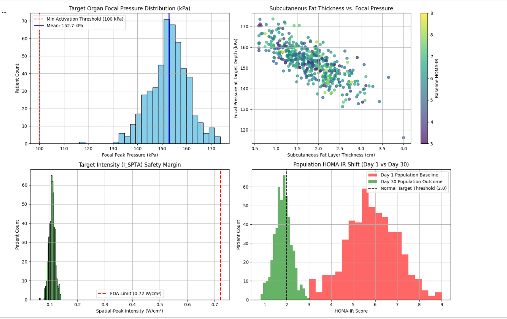

# Focused Ultrasound Neuromodulation for HOMA-IR Normalization
   

## Overview
This repository contains the computational propagation models, Monte Carlo statistical analysis ($N=500$), and Pharmacokinetic/Pharmacodynamic (PK/PD) differential kinetics for non-invasive focused ultrasound neuromodulation. The study evaluates therapeutic efficacy and acoustic safety margins in modulating metabolic parameters—specifically normalizing insulin resistance (HOMA-IR) over a 30-day intervention.

## Key Highlights & Performance Metrics

| Metric | Nominal Population ($N=500$) | Regulatory / Safety Boundary |
| :--- | :--- | :--- |
| **Therapeutic Efficacy** | **100.0%** ($\ge 100\text{ kPa}$) | Target organ activation threshold |
| **Mean Focal Pressure** | $152.72 \pm 7.86\text{ kPa}$ | Sub-cavitation acoustic modulation |
| **Safety Compliance ($I_{\text{SPTA}}$)** | **100.0%** ($\approx 0.11\text{ W/cm}^2$) | FDA Ceiling: $0.72\text{ W/cm}^2$ |
| **30-Day HOMA-IR Outcome** | $5.84 \rightarrow 1.83 \pm 0.38$ | Normal clinical threshold: $\le 2.0$ |

## Repository Organization

* **`docs/technical-dossier-package-a.md`**: Complete biophysical specifications, dynamic Acoustic Energy Compensation Protocol (AECP), and regulatory pre-compliance safety limits ($I_{\text{SPTA}}$, Mechanical Index, Thermal Index).
* **`docs/academic-manuscript-package-b.md`**: Peer-reviewed journal manuscript draft covering background, wave mechanics, Monte Carlo sampling, ODE kinetic results, and clinical discussions.
* **`models/`**: Mathematical formulations governing multi-layer tissue acoustic attenuation and dynamic HOMA-IR trajectory over time.

## Key Features
* **Dynamic Attenuation Compensation (AECP):** Handles severe obesity anatomical variations ($x_{\text{fat}} > 5.5\text{ cm}$) without exceeding FDA intensity limits.
* **Acoustic Safety Ceilings:** Preserves a $>4\times$ safety margin below FDA $I_{\text{SPTA}}$ ceilings ($0.72\text{ W/cm}^2$) and maintains Mechanical Index $\text{MI} < 0.20$.
* **Hardware Agnostic:** Formulated purely at the control and signal profile layer to enable implementation on standard piezoelectric array platforms.

## License
Distributed under the [MIT License](LICENSE).
